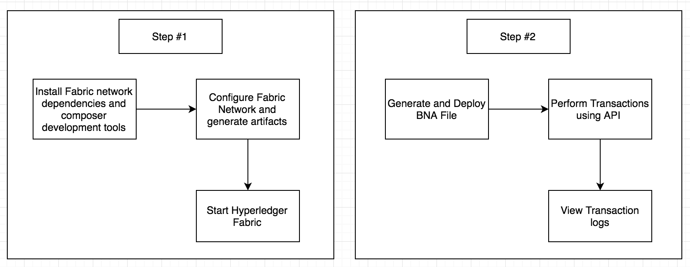
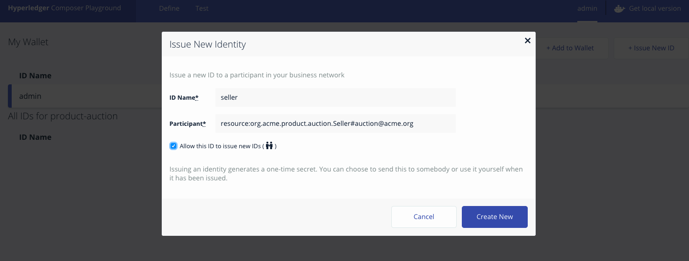
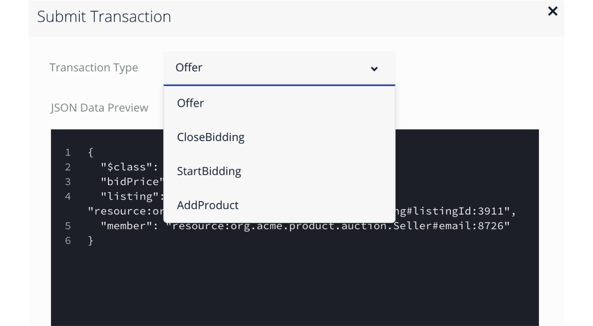
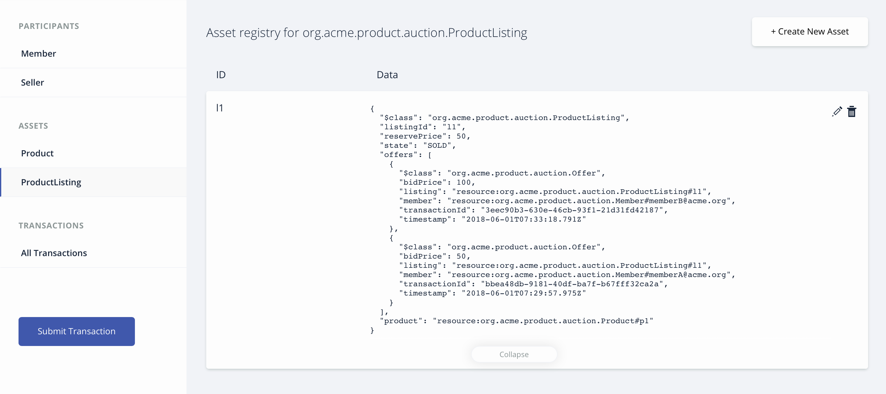
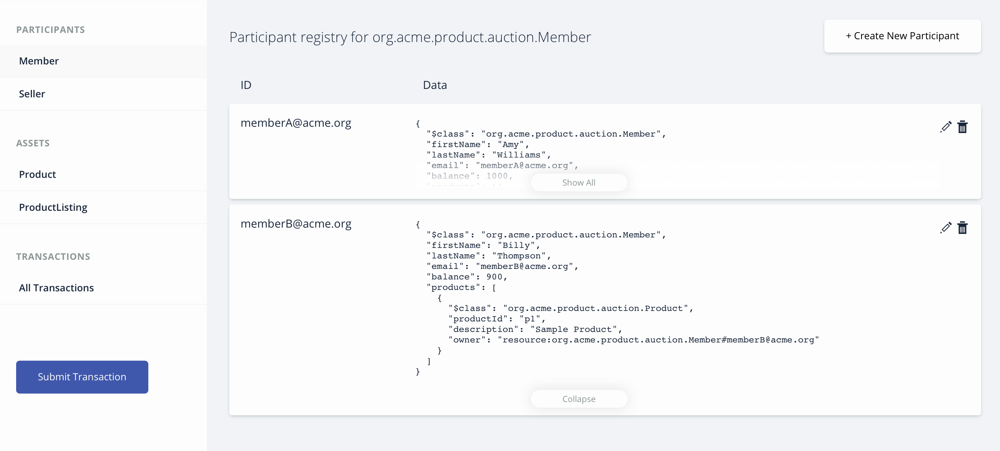

# 하이퍼레저 컴포저 - 상품 경매 네트워크

*Read this in other languages: [English](README.md).*

하이퍼레저 컴포저(Hyperledger Composer) Composite Journey의 Part 2에 오신 것을 환영합니다. 이는 [컴포저 네트워크 설정하기](https://github.com/IBM/BlockchainNetwork-CompositeJourney#build-your-first-hyperledger-network) 시리즈 중 하나입니다. 이 과정은 스마트 계약을 정의하기 위해 컴포저를 사용하는 좀 더 복잡한 내용을 다룹니다. 여러 참가자를 추가하고 블록체인 애플리케이션에 액세스 제어를 추가하는 방법을 배우게 됩니다. 그렇게하기 위해 - 대화형의 분산된 제품 경매 데모 네트워크를 만들 것입니다. 판매할 자산(예비 가격 설정)을 리스트에 넣으면, 경매 종료 후 예비 가격을 설정한 자산이 자동으로 최고 입찰자에게 이전됩니다. 또한 각 참가자는 permissions.acl 파일의 액세스 제어 규칙에 따라 다른 수준의 액세스 권한을 갖습니다. 이 ACL(Access Control List) 파일은 패브릭 컴포저 런타임에 의해 자동 적용되는 공유 및 개인 정보 보호를 위한 설정입니다.  
 
이 비즈니스 네트워크는 다음을 정의합니다:

**참가자:**
`Member` `Seller`

**자산:**
`Product` `ProductListing`

**거래:**
`AddProduct` `StartBidding` `Offer` `CloseBidding`

`addProduct` 함수는  `AddProduct` 트랜잭션이 제출될 때 호출됩니다. 이 로직을 따라 판매자는 제품 자산을 작성하고 레지스트리를 업데이트할 수 있습니다.

`publishListing` 함수는 제품의 소유자가 `StartBidding` 트랜잭션을 제출할 때 호출됩니다. 이 화면에서 판매자는 본인이 판매할 제품과 판매 시작가를 입력하여 스마트 계약을 생성할 수 있습니다.

`Offer` 트렌잭션이 제출되면 `makeOffer` 함수가 호출됩니다. 이 로직은 오퍼 리스트가 아직 판매 중인지를 단순히 확인한 다음, 해당 오퍼를 목록에 추가한 후  `ProductListing` 자산 레지스트리의 오퍼를 업데이트합니다.ㅎ
`closeBidding` 트랜잭션이 처리를 위해 제출되면 `closeBidding` 함수가 호출됩니다. 이 로직은 해당 리스트가 아직 판매중인지 확인하고 입찰 가격으로 오퍼를 정렬한 다음 준비금이 맞으면, 리스트와 연결된 제품의 소유권을 최고 입찰자에게 이전합니다. 구매자의 계좌에서 판매자의 계좌로 돈이 전송된 후 수정된 모든 자산이 각각의 레지스트리에서 업데이트됩니다.

`models` 디렉토리에있는 `product.cto` 파일은 자산, 참여자 및 트랜잭션에 대한 정의로 구성된 제품 경매 데모에 대한 데이터 모델을 정의합니다. `lib` 디렉토리에 있는 `logic.js` 파일은 `product.cto` 파일에 정의된 트랜잭션을 구현합니다. `.cto` 파일은 자산, 참여자 및 트랜잭션 측면에서 비즈니스 네트워크의 구조를 정의합니다.

`permissions.acl` 파일에 위치한 ACL 규칙으로 비즈니스 네트워크의 도메인 모델의 한 요소를 작성, 읽기, 업데이트 또는 삭제할 수 있는 사용자/역할을 결정합니다. 기본 `System` 사용자에게는 모든 권한이 있습니다. 네트워크 구성원은 모든 리소스에 대한 읽기 권한을 가지며 판매자는 제품을 만들고 제품에 대한 입찰을 시작하고 종료할 수 있습니다. 네트워크 회원은 제품 리스트에 대한 입찰을 할 수 있습니다. 참여자는 허용된 자원 및 트랜잭션에만 액세스할 수 있습니다.

## 구성 요소
* 하이퍼레저 패브릭
* 하이퍼레저 컴포저
* 도커

## 애플리케이션 워크플로우 도표 


여러 참가자 생성 및 ACL 추가
* 추가적인 참가자 추가
* Access Control Lists(엑세스 제어 리스트) 추가
* 체인코드 쿼리 및 호출

## Steps
1. [비즈니스 네트워크 아카이브 (BNA) 생성하기](#1-비즈니스-네트워크-아카이브-bna-생성하기)
2. [컴포저 플레이그라운드를 사용하여 비즈니스 네트워크 아카이브 배포하기](#2-컴포저-플레이그라운드를-사용하여-비즈니스-네트워크-아카이브-배포하기)
3. [로컬에 있는 하이퍼레저 컴포저에 비즈니스 네트워크 아카이브 (BNA) 배포하기](#3-로컬에-있는-하이퍼레저-컴포저에-비즈니스-네트워크-아카이브-bna-배포하기)

## 1. 비즈니스 네트워크 아카이브 (BNA) 생성하기

파일 구조가 유효한지 확인하려면 비즈니스 네트워크 정의에 대한 BNA (Business Network Archive) 파일을 생성합니다. BNA 파일은 배포 가능한 유닛으로, 실행을 위해 컴포저 런타임에 배포할 수 있습니다.

다음 명령을 사용하여 네트워크 아카이브를 생성합니다:
```bash
npm install
```
다음과 같은 결과가 나옵니다:
```bash
> mkdirp ./dist && composer archive create --sourceType dir --sourceName . -a ./dist/product-auction.bna

Creating Business Network Archive

Looking for package.json of Business Network Definition
	Input directory: /Users/ishan/Documents/git-demo/BlockchainBalanceTransfer-CompositeJourney

Found:
	Description: Sample product auction network
	Name: product-auction
	Identifier: product-auction@0.0.1

Written Business Network Definition Archive file to
	Output file: ./dist/product-auction.bna

Command succeeded
```
`composer archive create` 명령을 사용하면 `dist`폴더 안에 `product-auction.bna` 파일이 생성됩니다.

Node.js 프로세스에서 '블록체인' 인메모리 상태를 저장하는 임베디드 런타임에 대해 비즈니스 네트워크 정의를 테스트할 수 있습니다. 프로젝트 작업 디렉토리에서 test/productAuction.js 파일을 열고 다음 명령을 실행하십시오:
```
npm test
```
다음과 같은 결과가 나옵니다 :
```
> product-auction@0.0.1 test /Users/ishan/Documents/git-demo/BlockchainBalanceTransfer-CompositeJourney
> mocha --recursive

  ProductAuction - AddProduct Test
    #BiddingProcess
      ✓ Add the product to seller list (119ms)
      ✓ Authorized owner should start the bidding (90ms)
      ✓ Members bid for the product (127ms)
      ✓ Close bid for the product (53ms)


  4 passing (2s)
```

## 2. 컴포저 플레이그라운드를 사용하여 비즈니스 네트워크 아카이브 배포

[컴포저 플레이그라운드](http://composer-playground.mybluemix.net/)를 열어서, 기본 샘플 네트워크를 가져옵니다.
이전에 플레이그라운드를 사용한 적이 있다면, 브라우저 콘솔에서 `localStorage.clear()` 을 사용해 브라우저 로컬 저장소를 지우십시오. 이제 `product-auction.bna` 파일을 가져와서 deploy 버튼을 클릭합니다.


**테스트** 탭에서 이 비즈니스 네트워크 정의를 테스트하려면:


`Seller` 참여자 레지스트리에서 새 참여자를 작성하십시오. 맨 왼쪽에 있는 `Seller` 탭을 클릭하십시오.

```
{
  "$class": "org.acme.product.auction.Seller",
  "organisation": "ACME",
  "email": "auction@acme.org",
  "balance": 100,
  "products": []
}
```

`Member` 참여자 레지스트리에서 두 명의 참가자를 만듭니다. 다시 왼쪽 끝에있는`Member` 탭을 클릭하십시오.

```
{
  "$class": "org.acme.product.auction.Member",
  "firstName": "Amy",
  "lastName": "Williams",
  "email": "memberA@acme.org",
  "balance": 1000,
  "products": []
}
```

```
{
  "$class": "org.acme.product.auction.Member",
  "firstName": "Billy",
  "lastName": "Thompson",
  "email": "memberB@acme.org",
  "balance": 1000,
  "products": []
}
```

이제 **Access Control**을 추가할 준비가 되었습니다. 먼저 `admin` 탭을 클릭하여 참가자에게 **새로운 ID**를 발급하고 ID를 월렛에 추가하십시오. 아래 이미지와 같이 지침을 따르십시오:

*실제로 월렛에 추가하려면 옵션 2에서 +add to my Wallet을 클릭하십시오.





`Wallet tab`에서 `seller id`를 선택하십시오. `test tab`을 클릭하여 `AddProduct` 및 `StartBidding` 트랜잭션을 수행합니다.


이제 `Submit Transaction` 버튼을 클릭하여 드롭다운 박스 중에 `AddProduct` 트랜젝션을 선택하여 판매자용 상품을 생성합니다.


```
{
  "$class": "org.acme.product.auction.AddProduct",
  "description": "Sample Product",
  "owner": "resource:org.acme.product.auction.Seller#auction@acme.org"
}
```
제품 및 판매자 레지스트리를 확인하여 트랜잭션을 확인할 수 있습니다.

위의 제품에 대한 제품 목록을 작성하려면 제품 레지스트리에서 `ProductID`를 복사하십시오. 그런 다음 `StartBidding` 트랜잭션을 제출합니다. `<ProductID>`부분을 방금 복사한 제품 ID로 변경하여 제출하셔야 합니다.

```
{
  "$class": "org.acme.product.auction.StartBidding",
  "reservePrice": 50,
  "product": "resource:org.acme.product.auction.Product#<ProductID>"
}
```

귀하는 방금 `Sample Product`를 예비가격 50에 경매에 등록했습니다!
상태가 `FOR_SALE`인 제품들은 `ProductListing` 레지스트리에 목록이 생성됩니다.

이제 회원 참여자는 제품 리스트에 입찰하기 위해 `Offer` 트랜젝션을 제출할 수 있습니다.

각 `member id`에 대해 `Wallet tab`에서 사용자 ID를 선택합니다. `Offer` 트랜젝션을 제출하려면 `test tab` 선택하여 `Submit Transaction` 버튼을 클릭하십시오.
> `ListingID`는 `ProductListing` 레지스트리에서 복사한 리스트의 ID입니다.

```
{
  "$class": "org.acme.product.auction.Offer",
  "bidPrice": 50,
  "listing": "resource:org.acme.product.auction.ProductListing#<ListingID>",
  "member": "resource:org.acme.product.auction.Member#memberA@acme.org"
}
```

```
{
  "$class": "org.acme.product.auction.Offer",
  "bidPrice": 100,
  "listing": "resource:org.acme.product.auction.ProductListing#<ListingID>",
  "member": "resource:org.acme.product.auction.Member#memberB@acme.org"
}
```

`ProductListing` 레지스트리를 확인하면 제품의 모든 입찰 내역을 볼 수 있습니다.


이제 다시 `Wallet tab`탭에서 `seller id`를 선택합니다. `test tab`을 클릭하여 목록에 대한 `CloseBidding` 트랜잭션을 제출하여 경매를 종료하십시오.

```
{
  "$class": "org.acme.product.auction.CloseBidding",
  "listing": "resource:org.acme.product.auction.ProductListing#<ListingID>"
}
```

이는 단순히 `ListingID` 대한 경매가 종료되어 앞서 설명한 `closeBidding`함수를 트리거합니다.

제품 판매 여부를 확인하려면 `ProductListing` 자산 레지스트리를 클릭하고 제품의 소유자를 확인해야 합니다. 최고 입찰액은 소유자인 `memberB@acme.org`가 제출했으므로 `memberB@acme.org`가 제품의 소유자여야 합니다.

`<ListingID>`로 ProductListing의 상태가 `SOLD`인지 확인할 수 있습니다.



구매자와 판매자의 업데이트된 자산 목록을 확인하려면 `Member` 자산 레지스트리를 클릭하십시오. 제품이 구매자인 `memberB@acme.org`의 제품 리스트에 추가됩니다.



`All transactions` 탭을 선택하여 모든 트랜젝션의 내역을 볼 수 있습니다.


> 또한 모든 `System user`에게 액세스를 허용하려면 `permissions.acl`에 규칙이 있으므로 기본 설정인 `System user`를 사용하여 모든 작업을 수행할 수 있습니다.

## 3. 로컬에 있는 하이퍼레저 컴포저에 비즈니스 네트워크 아카이브 (BNA) 배포하기

[instructions](https://github.com/IBM/BlockchainNetwork-CompositeJourney#2-starting-hyperledger-fabric)을 따라 로컬 패브릭을 시작하십시오. 이제 디렉토리를 `product-auction.bna`파일이 들어있는 `dist`폴더로 변경하고 다음을 입력하십시오:
```
cd dist
composer runtime install --card PeerAdmin@hlfv1 --businessNetworkName product-auction
composer network start --card PeerAdmin@hlfv1 --networkAdmin admin --networkAdminEnrollSecret adminpw --archiveFile product-auction.bna --file networkadmin.card
composer card import --file networkadmin.card
```

다음을 입력하여 네트워크 배포 여부를 확인할 수 있습니다:
```
composer network ping --card admin@product-auction
```

다음과 같은 결과를 확인할 수 있습니다:
```
The connection to the network was successfully tested: product-auction
	version: 0.16.0
	participant: org.hyperledger.composer.system.NetworkAdmin#admin

Command succeeded
```

REST API를 만들려면 `composer-rest-server`를 시작하여 배포된 비즈니스 네트워크의 접속 정보를 설정합니다.
이제 디렉토리를 제품 경매 폴더로 변경하고 다음을 입력하여 서버를 시작하십시오:
```bash
cd ..
composer-rest-server
```

시작할 때 나타난 질문들에 답하십시오. 이를 통해 composer-rest-server는 하이퍼레저 패브릭에 연결하고 REST API 생성 방법을 구성할 수 있습니다.
* 카드 이름으로 `admin@product-auction`를 입력하십시오.
* 생성된 API에서 네임스페이스 사용 여부를 묻는다면 `never use namespaces`를 선택합니다.
* 생성된 API의 보안 여부를 묻는다면 `No`를 선택합니다.
* 이벤트 게시를 활성화할지 묻는다면 `Yes`를 선택합니다.
* TLS 보안의 사용 여부를 뭍는다면 `No`를 선택합니다.

**REST API 테스트**

composer-rest-server가 성공적으로 시작된 경우, 다음 두 줄이 출력되어야 합니다:
```
Web server listening at: http://localhost:3000
Browse your REST API at http://localhost:3000/explorer
```

브라우저를 열어서 http://localhost:3000/explorer 로 이동합니다.

You should see the LoopBack API Explorer, allowing you to inspect and test the generated REST API. Follow the instructions to test Business Network Definition as mentioned above in the composer section. 생성된 REST API를 검사하고 테스트할 수 있도록 LoopBack API Explorer가 표시되어야 합니다. 위의 지시사항에 따라 컴포저 섹션에서 설명한대로 비즈니스 네트워크 정의(Business Network Definition)를 테스트하십시오.

## 3단계로 이동할 준비가 되었습니다!
축하합니다 - 2단계를 완수하셨습니다. 이제 [3단계](https://github.com/IBM/BlockchainEvents-CompositeJourney)로 이동합니다.

## 추가 리소스
* [Hyperledger Fabric Docs](http://hyperledger-fabric.readthedocs.io/en/latest/)
* [Hyperledger Composer Docs](https://hyperledger.github.io/composer/introduction/introduction.html)

## 라이센스
[Apache 2.0](LICENSE)
